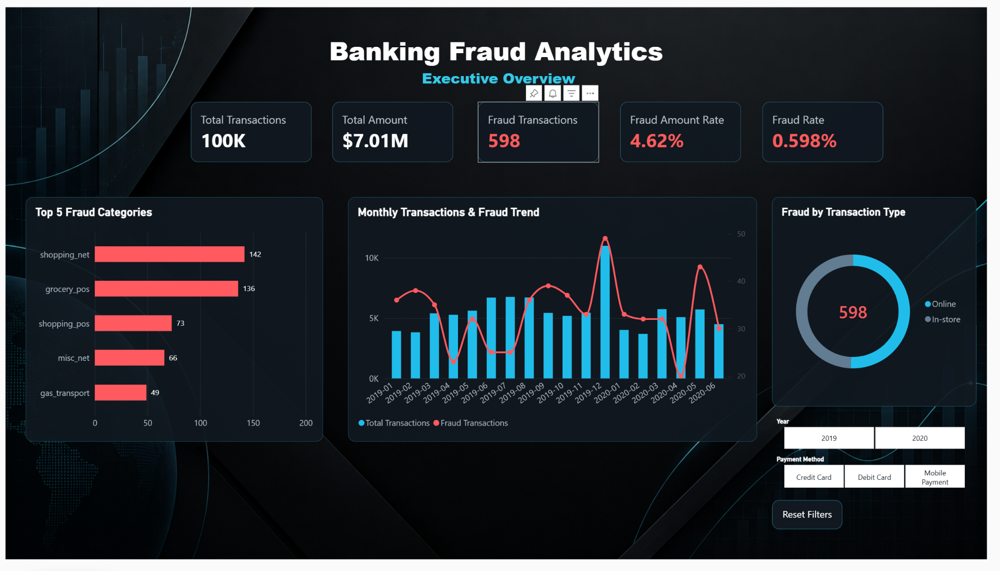
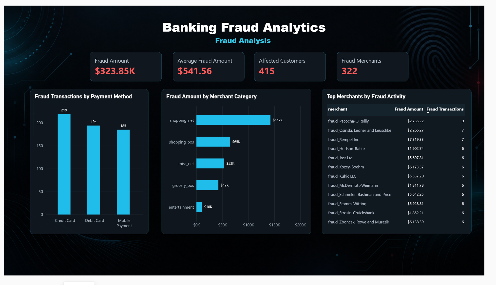
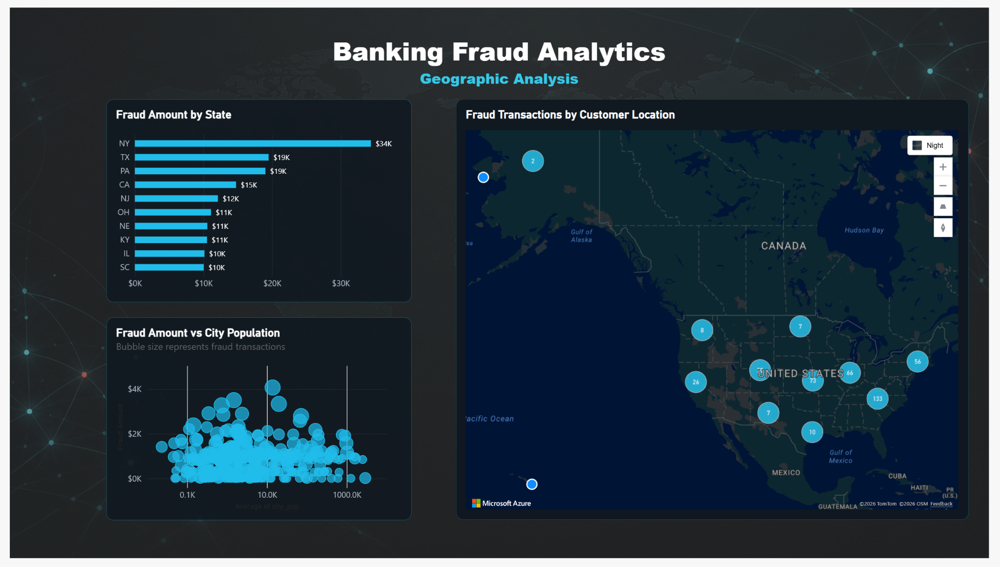

# Banking Fraud Analytics

This is my first project using Microsoft Fabric. I created it to practice the full process from loading raw data into a Lakehouse to building a Power BI report.

The dataset contains 100,000 banking transactions. The main goal was to clean the data, organize it using the Bronze, Silver, and Gold layers, and analyze fraudulent transactions.

## Project Steps

- Loaded the original CSV file into the Bronze layer.
- Used PySpark to clean and prepare the data in the Silver layer.
- Created fact and dimension tables for the Gold layer.
- Built a semantic model using Direct Lake.
- Created a Power BI report with three pages.

## Tools Used

- Microsoft Fabric
- Lakehouse
- PySpark
- Delta tables
- Direct Lake
- Power BI
- DAX

## Notebooks

- [Bronze to Silver Notebook](NB_Bronze_To_Silver.ipynb)
- [Silver to Gold Notebook](NB_Silver_To_Gold.ipynb)

## Report Pages

### Executive Overview

### Fraud Analysis

### Geographic Analysis

## Dataset

The dataset used in this project is [Credit Card Transactions with Fraud Detection](https://www.kaggle.com/datasets/hnytfo/credit-card-transactions-with-fraud-detection?select=fraud_detection_credit_card_small.csv) from Kaggle, used for learning and practice.
